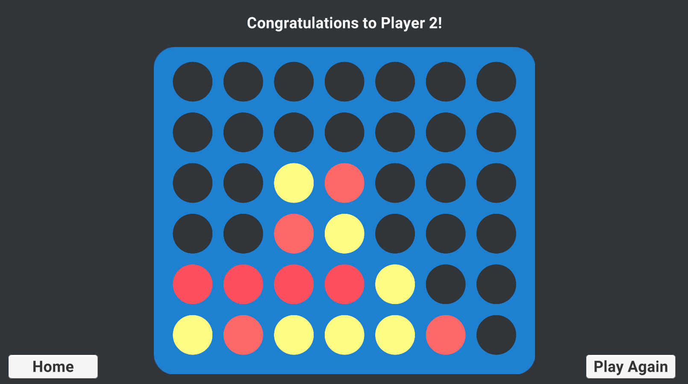
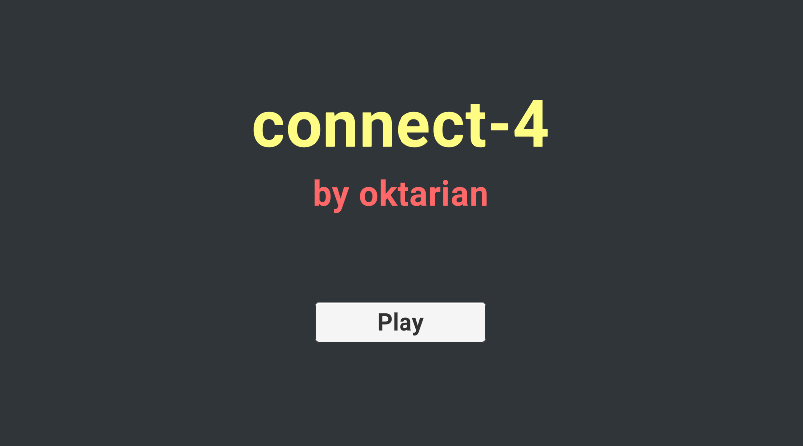
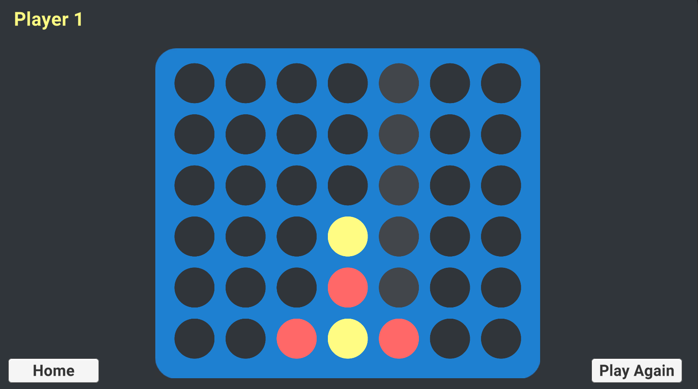

# Connect-4
The classic game we all know: Connect 4, with automatic win detection. Be the first player to get 4 or more of your colored coins aligned!

This is a game I have played countless times with friends and family, so I thought it would be a fun project to work on over a few days. I developped the game by myself without using any external resources. I am very pleased with the final result. 

I am happy to invite you to try the game out in your web browser: [Connect-4](https://oktarian.itch.io/oktarians-connect-4). A second player is required if you want the full experience, not much challenge playing against yourself!

### Features:
* Players can place their coin in turn on the board
* The game automatically checks for a winning combination every time a coin is placed by looking for aligned coins vertically, horizontally and diagonally based on the location the coin is placed at
* Created an UI that is intuitive and provides a good user experience

### Screenshots:

&nbsp;

&nbsp;

